<div align="center">

<h1>🛡️ FrpFireWall</h1>
<p><strong>给公网 frps 加一道看得见的防线</strong></p>
<p>频次控制 · 阶梯封禁 · 黑白名单 · IP 属地 · Web 控制台</p>

[](https://github.com/dreamstation625/FrpFireWall/actions/workflows/ci.yml)
[](https://github.com/dreamstation625/FrpFireWall/releases)
[](go.mod)
[](web/package.json)
[](docs/DEVELOPMENT.md#交叉编译与产物)
[](internal/web/web.go)

<p>
  <a href="#quick-start">快速开始</a> ·
  <a href="#screenshots">界面预览</a> ·
  <a href="#capabilities">核心能力</a> ·
  <a href="#development">开发编译</a> ·
  <a href="docs/README.md">文档中心</a> ·
  <a href="https://github.com/dreamstation625/FrpFireWall/releases">下载版本</a>
</p>

</div>

---

FrpFireWall 是运行在 **frps 同机**的服务端插件防火墙，用于应对公网扫描、频繁连接与暴力尝试。
**Go 后端 + Vue 控制台打包为单个二进制**，部署无需额外安装 Go、Node.js 或数据库服务。

> [!WARNING]
> **部署前必读**
>
> 1. **系统支持**：优先面向 **Debian / Ubuntu**，预期可以正常运行；**其他 Linux 发行版不保证兼容，Windows 不支持部署运行**。
> 2. **提前备份**：本项目会修改服务器防火墙规则，建议使用前先做好**服务器备份或快照**，并保存现有防火墙规则与关键配置。
> 3. **后端适配**：理论上适配 **iptables 和 nftables**，实际可用功能取决于系统、内核版本及相关模块。
> 4. **未完成验证的功能**：受测试环境与条件限制，**速率限制尚未完成全面实测验证**。已有局部验证不代表所有场景均可用，上线前请在自己的环境中单独测试。

| 🧠 应用层判定 | ⚡ 网络层拦截 | 🖥️ 可视化管理 |
| --- | --- | --- |
| `Login` / `NewUserConn` 回调识别来源与规则 | iptables / nftables 执行已触发的封禁 | 配置策略、查询封禁、查看事件与审计 |

> [!IMPORTANT]
> 连接频控在 frps 插件应用层执行，程序只管理自身的防火墙对象。**自动封禁固定为全端口**；
> 手动黑名单可选全端口、仅 frp 端口或自定义端口。上线前请先了解[封禁范围](docs/FEATURES.md#黑名单的封禁范围)。

<a id="screenshots"></a>

## 界面预览

从概览查看封禁规模、拦截趋势与运行状态；展开下方截图，查看策略配置、名单管理和事件追踪。

[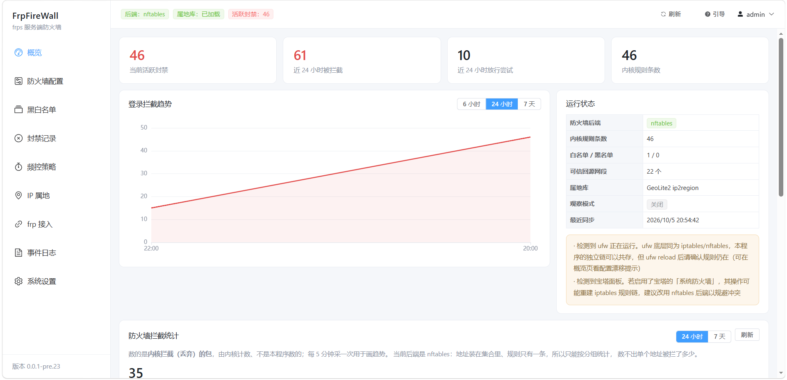](img/1.png)

<details>
<summary>📊 拦截统计与防火墙配置</summary>

[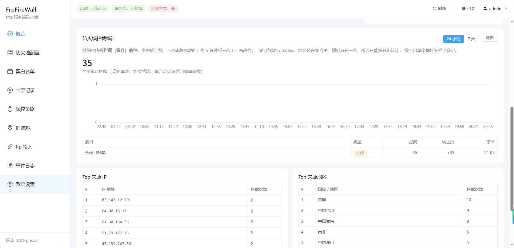](img/2.png)

[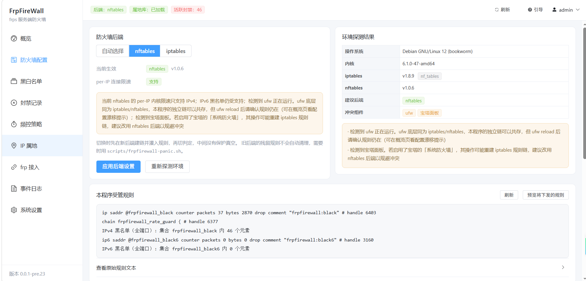](img/3.png)

</details>

<details>
<summary>🛡️ 黑白名单与封禁记录</summary>

[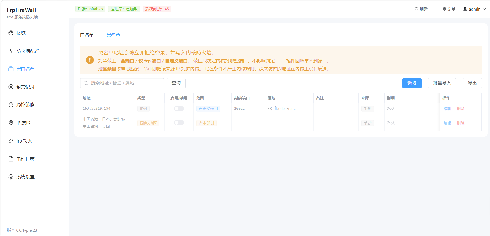](img/4.png)

[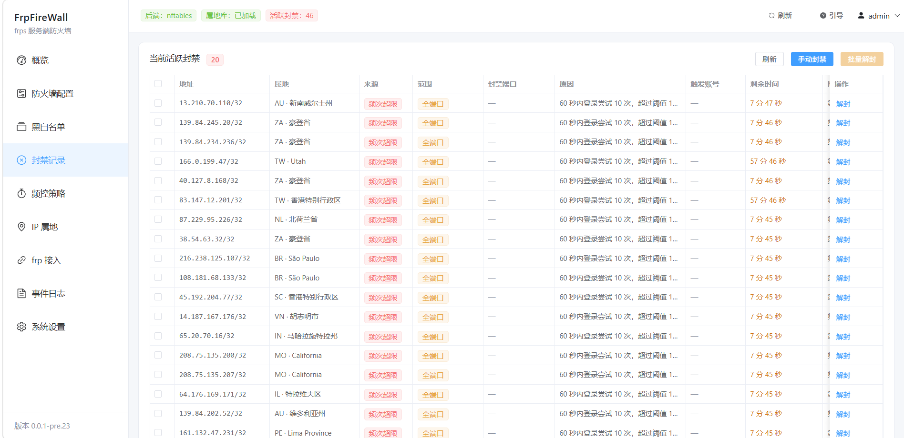](img/6.png)

</details>

<details>
<summary>⚙️ 频控策略与 IP 属地</summary>

[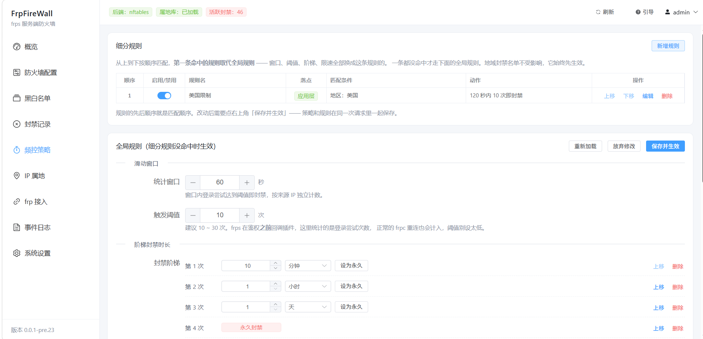](img/7.png)

[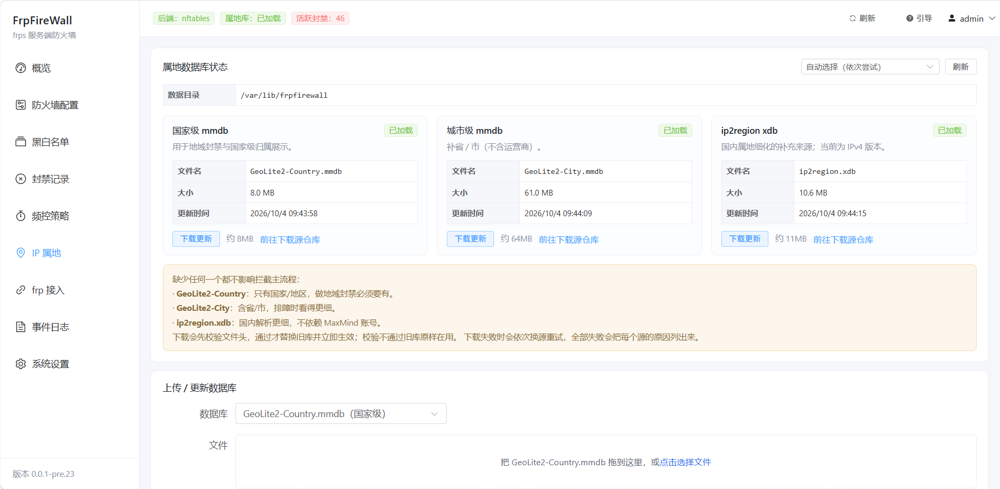](img/8.png)

</details>

<details>
<summary>🔌 frp 接入与事件日志</summary>

[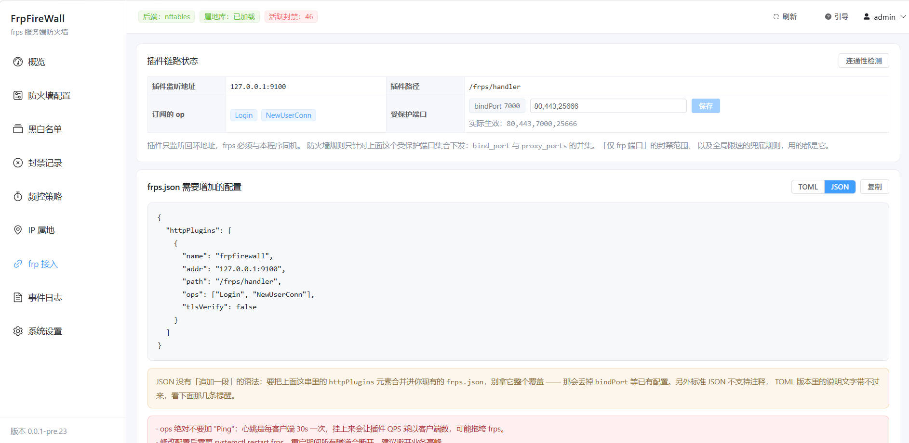](img/9.png)

[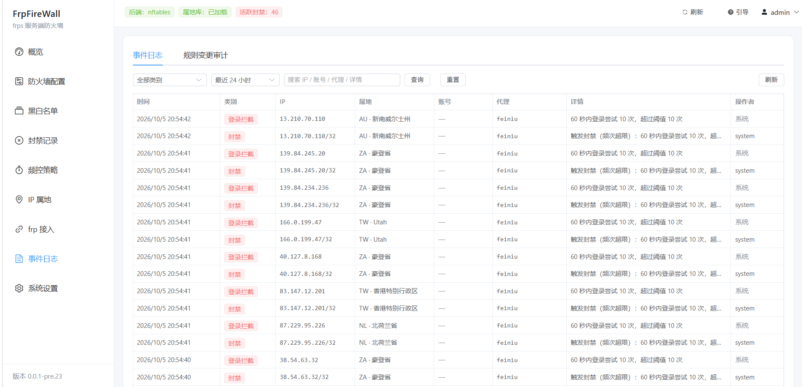](img/10.png)

</details>

<details>
<summary>🌐 附：多地区多线路 HTTP 测速截图</summary>

[](img/http_多地区多线路HTTP测速.png)

</details>

## 关键设计约束

改代码或判断行为前先看这几条（完整 12 条在 [`docs/DESIGN.md`](docs/DESIGN.md#design-constraints)）：

1. **插件调用同步阻塞，默认 fail-open**：判定有 100ms 超时，默认在超时或 panic 时放行，
   避免插件异常拖断 frp。频控策略可显式切换 fail-close，切换后异常也会拒绝连接。
2. **绝不 flush 整表**：只用自己的链 / 集合 / 带 `frpfirewall` 注释的规则，
   ufw、firewalld、手工规则一律不碰。
3. **白名单是「豁免本程序封禁」，不是「全端口放行」**：实现是生成黑名单时把白名单减掉，
   不往内核写豁免规则。
4. **细分频控统一在应用层匹配和计数**：代理名、目的端口可与地区、来源条件组合，填写的各项必须同时命中；限速拒绝也计入窗口；
   固定 TCP 端口通过 `NewProxy` / `CloseProxy` 回调自动学习，代理名和端口均可选，无需 Dashboard。只有达到封禁阈值或命中直接拦截时才新增内核封禁；自动封禁仍为全端口。
5. **地区拦截是「命中即封该 IP」**：属地库只能"给 IP 问地区"，反查不出某国的 CIDR，
   所以地区条目一条内核规则都不预先写，而是等某个 IP 连上来查出属地才封它。
6. **封禁状态以数据库为准，重启靠全量重建受管链自愈**：进程退出时不清理内核规则
   （清理会让重启那几秒变成不设防的窗口），启动时筛一遍未到期的装回内存再重建。
   停机期间到期的会被清掉，不会留下"界面显示封禁中、内核其实没封"的行。

<a id="quick-start"></a>

## 快速开始

**部署前提：** Debian / Ubuntu 宿主机、systemd、root，以及 iptables（含 ip6tables）或 nftables。
程序与 frps 运行在同一台机器；发布产物提供 `linux/amd64` 与 `linux/arm64`。

### 1. 安装（Debian / Ubuntu）

直连装最新**正式版**：

```bash
curl -fsSL https://raw.githubusercontent.com/dreamstation625/FrpFireWall/main/scripts/install.sh | sudo bash
```

装**预发布版**加 `--pre`（它要直连 `api.github.com` 列版本，见下方说明）：

```bash
curl -fsSL https://raw.githubusercontent.com/dreamstation625/FrpFireWall/main/scripts/install.sh | sudo bash -s -- install --pre
```

国内慢就加加速前缀 —— **脚本地址和下载地址各加一次**，两处都要改：

```bash
# 正式版
curl -fsSL https://ghfast.top/https://raw.githubusercontent.com/dreamstation625/FrpFireWall/main/scripts/install.sh | sudo bash -s -- install --mirror https://ghfast.top/

# 预发布版
curl -fsSL https://ghfast.top/https://raw.githubusercontent.com/dreamstation625/FrpFireWall/main/scripts/install.sh | sudo bash -s -- install --pre --mirror https://ghfast.top/
```

脚本做的事：校验环境（root / systemd / iptables 或 nftables）→ 下载并逐个核对 sha256 →
原子替换二进制 → 写 systemd 单元并启动。升级时新版本起不来会自动换回旧二进制。

- **先审再跑**（推荐）：`curl -fsSLO <脚本URL>` 下来 `less` 一遍再 `sudo bash install.sh`。
- **离线 / 指定版本**：二进制、`install.sh`、`frpfirewall.service` 放同一目录，
  `sudo bash install.sh -b ./frpfirewall-linux-amd64`；`-v 0.0.1-pre.22` 装指定版本
  （指定版本不走 API，API 不通时用它）。
- **加速前缀不内置**：脚本不含任何第三方地址，要不要加速、用哪个前缀由你决定。

### 2. 设置面板密码

面板默认监听 `0.0.0.0:7930`，装完对所有网卡可达。打开 `http://<本机IP>:7930` 会跳到初始化页，
填入启动时打印的令牌（同时保存在 `/var/lib/frpfirewall/setup_token.txt`）并自行设置密码，
令牌随即作废。

**令牌不能省**：面板默认对全网开放，去掉令牌就等于"谁先访问谁当管理员"——它要证明的是
你能读这台机器的日志或文件。

初始化完成后会**自动走一遍教学引导**（接通 → 定规则 → 查结果）；想再看，点顶栏
**「引导」**或右上角用户菜单里的「教学引导」。云服务器**记得放行安全组的 7930 入站**。

面板是管理接口，暴露面要主动想清楚：

- **开启 HTTPS**（系统设置 → HTTPS），否则登录密码是明文传输——这条别跳过
- 登录有防爆破：5 分钟窗口 8 次失败锁定 10 分钟
- 不想对外暴露就装的时候加 `--listen 127.0.0.1:7930`，再走 SSH 隧道
  `ssh -L 7930:127.0.0.1:7930 root@<服务器>`；或用云安全组只放行自己的出口 IP

### 3. 接入 frps

面板 → **frp 接入** → 复制配置片段（右上角可切 **TOML / JSON**，frp v0.52.0 起都支持）。

`frps.toml` 追加到文件末尾；`frps.json` 没有"追加"语法，要把 `httpPlugins` 元素
**合并进现有配置**（整个覆盖会丢掉 `bindPort` 等已有项）：

```toml
[[httpPlugins]]
name = "frpfirewall"
addr = "127.0.0.1:9100"
path = "/frps/handler"
ops = ["Login", "NewProxy", "CloseProxy", "NewUserConn"]
tlsVerify = false
```

**`ops` 使用上述四项，不要加 `Ping`** —— 心跳是每客户端 30s 一次，挂上来会让插件调用量
乘以客户端数，小内存机器上足以把 frps 拖垮。

代理端口规则需收到 `NewProxy` 后才能识别固定 TCP 端口；更新插件配置后请让 frpc 重新连接。
端口映射仅保存在内存，FrpFireWall 重启后需重新连接学习；可在 **frp 接入 → 代理端口映射** 核对。
随机端口、负载均衡组和共享端口暂不支持，未知端口会跳过带端口条件的规则。多个插件修改代理配置时，应将本插件排在最后。

同一页的「受保护端口」= `bindPort` ∪ 代理端口，决定「仅 frp 端口」封哪些端口。
`bindPort` 只读，能改的是代理端口那一半（支持区间，如 `20000-30000`），保存**立即生效**。

改完先验证再重启：

```bash
frps verify -c /etc/frp/frps.toml    # 或 frps.json
sudo systemctl restart frps
```

### 4. GeoIP 数据库（可选）

不放也能跑，只是属地显示与国家封禁不可用。三个库各自独立加载，缺哪个不影响其它库；
面板 **IP 属地** 页可一键下载更新（支持加速源）。各库作用与多库合并顺序见
[`docs/FEATURES.md`](docs/FEATURES.md#geoip-数据库可选)。

## 升级与卸载

```bash
SCRIPT=https://raw.githubusercontent.com/dreamstation625/FrpFireWall/main/scripts/install.sh

curl -fsSL $SCRIPT | sudo bash -s -- status      # 当前版本 / 线上最新正式版
curl -fsSL $SCRIPT | sudo bash -s -- update      # 升级到最新正式版（未装则等同 install）
curl -fsSL $SCRIPT | sudo bash -s -- uninstall   # 卸载：清内核规则、删二进制与单元，数据目录保留
curl -fsSL $SCRIPT | sudo bash -s -- uninstall --purge -y   # 连数据目录一起删
```

国内加速 / 预发布版：`SCRIPT` 换成带前缀的地址，`status` 与 `update` 加 `--pre`，
要下载的命令再加 `--mirror`：

```bash
SCRIPT=https://ghfast.top/https://raw.githubusercontent.com/dreamstation625/FrpFireWall/main/scripts/install.sh

curl -fsSL $SCRIPT | sudo bash -s -- status --pre
curl -fsSL $SCRIPT | sudo bash -s -- update --pre --mirror https://ghfast.top/
```

两条卸载命令在两种写法下完全一样（不下载任何东西，不需要 `--mirror` / `--pre`）；
`--purge` 会二次确认，`-y` 可跳过。

⚠️ `--pre` 要列所有 release 的 tag，走的是 `api.github.com`，**加速前缀不覆盖 API**
（实测镜像地址请求 API 返回 403）。API 不通就用 `-v 0.0.1-pre.22` 指定版本，
这条路径不查 API、下载仍受 `--mirror` 加速。

常用开关：`-y` 免交互、`--force` 允许降级或同版本重装、`--no-start` 只装不启、
`--dry-run` 只解析不动手、`--pre` 允许预发布版。完整列表见 `--help`。
版本更新也可以在面板点侧边栏底部的版本号查看（只读检查，不自动替换自身）。

## 配置

没有配置文件。**所有配置都在数据目录的 SQLite（`data/frpfirewall.db`）里**，
在面板 **系统设置** 页修改。多数改动重启后生效；**代理端口**与**事件保留天数**立即生效。

启动只需指定数据目录：`frpfirewall -data /var/lib/frpfirewall`

| 项 | 默认值 | 说明 |
| --- | --- | --- |
| 面板监听 | `0.0.0.0:7930` | 默认对所有网卡开放；只给本机用 `127.0.0.1:7930` |
| HTTPS | 关闭 | 面板暴露公网时开启，否则密码明文传输 |
| 登录有效期 | 12 小时 | JWT token 的 TTL |
| 插件监听 | `127.0.0.1:9100` | 只允许回环，frps 必须同机 |
| bindPort | 7000 | frps 的 bindPort，用于下发连接速率限制 |
| 代理端口 | `80,443` | `NewUserConn` 参与判定的端口，支持区间（如 `20000-30000`） |
| 可信回源网段 | 自定义列表为空 | 内置 Cloudflare 网段；可追加 CIDR。跳过后续自动封禁决策，不解析访客 HTTP 头；手动黑名单与已有封禁仍优先 |
| 总开关 | 开 | 关闭后只判定不写规则 |
| 观察模式 | 关 | 自动策略只记录并放行，不下发内核限速；人工黑名单与人工封禁继续生效 |
| 日志级别 | `info` | `debug` / `info` / `warn` / `error` |
| 事件保留 | 30 天 | 超期事件定时清理；填 `0` 永久保留。调小会立刻删除超期记录，不可恢复 |
| 在线检查更新 | 开 | 关闭后面板不访问 GitHub，纯内网部署建议关掉 |
| 检查来源 | `dreamstation625/FrpFireWall` | 查询 Release 的 GitHub 仓库（`owner/name`） |

运行期策略（频次阈值、阶梯时长、地域封禁、速率限制）在 **频控策略** 页，改完即时生效。

### 功能详解

具体口径、边界与踩坑点都在 [`docs/FEATURES.md`](docs/FEATURES.md)：

| 功能 | 一句话 |
| --- | --- |
| [频控细分规则](docs/FEATURES.md#频控细分规则) | 按国家 / 省份 / 城市 / 网段 / 代理名 / 端口分流，命中的取代全局规则 |
| [按地区拦截](docs/FEATURES.md#按地区拦截国家--省份--城市) | 名单条目选地区类型，命中即封该 IP（不预先占内核） |
| [黑名单封禁范围](docs/FEATURES.md#黑名单的封禁范围) | 每条可选「全端口」/「仅 frp 端口」/「自定义端口」 |
| [服务器出口 IP](docs/FEATURES.md#服务器出口-ip) | 探测本机公网出口并提示加白名单，避免自锁 |
| [防火墙拦截统计](docs/FEATURES.md#防火墙拦截统计) | 内核实际丢包统计（与事件日志是两套数字，别相加） |
| [事件日志](docs/FEATURES.md#事件日志记了什么) | 时间 / 类别 / IP / 属地 / 账号 / 代理 / 详情 / 操作者 |

## 运维

```bash
systemctl status frpfirewall
journalctl -u frpfirewall -f
systemctl restart frpfirewall
```

**误封导致连不上**（或规则下发后网络异常）：

```bash
sudo systemctl stop frpfirewall          # 必须先停，否则 reconcile 会把规则重新下发
sudo frpfirewall-panic --dry-run         # 先看会做什么
sudo frpfirewall-panic                   # 只删归属 frpfirewall 的对象
```

救援脚本只清网络层，应用层封禁记录还在数据库里。
脚本清理全部受管子链与集合，失败返回非零；详见[救援流程](docs/TROUBLESHOOTING.md#误封导致连不上)。
**面板打不开、忘记密码、判定顺序** 见 [`docs/TROUBLESHOOTING.md`](docs/TROUBLESHOOTING.md)；
查某个地址为什么被拦：面板 **封禁记录 → 排障查询**，输入 IP 返回当前状态与命中原因。

<a id="development"></a>

## 开发与编译

### 开发环境

| 工具 / 环境 | 要求 | 用途 |
| --- | --- | --- |
| Go | **1.26.4 或更高**，以 [`go.mod`](go.mod) 为准 | 后端开发、测试与编译；CI 读取同一文件 |
| Node.js + npm | **Node.js 22.x（≥ 22.12.0）**，与 CI 保持一致；npm 随 Node.js 提供 | Vue 前端开发与构建，依赖锁定在 `web/package-lock.json` |
| Git | 可用的 Git 命令行 | 拉取源码、记录构建提交号 |
| Bash + GNU Make | 使用 `make` 时需要；Windows 可直接执行 PowerShell 步骤 | 一键构建与 Linux 交叉编译 |
| Python 3 + curl | 安装脚本回归测试时需要 | 运行本地假 Release 服务并请求测试接口 |
| Debian / Ubuntu | 验证实际防火墙行为时需要 | systemd、iptables / nftables 与真实 Linux 内核 |

**Windows 仅用于开发和交叉编译，不支持部署运行本项目的防火墙服务；实际生效验证需要 Linux。** SQLite 使用纯 Go 实现，
构建设置 `CGO_ENABLED=0`，无需安装 C 编译器。完整 Windows 命令见[开发指南](docs/DEVELOPMENT.md#windowspowershell)。

### 从源码构建（Bash + Make）

```bash
git clone https://github.com/dreamstation625/FrpFireWall.git
cd FrpFireWall

go mod download
make build       # 先构建前端，再编译当前平台二进制 → dist/frpfirewall
make test        # 单元测试 → go vet → 编译检查
make release     # Linux amd64 + arm64 二进制及校验和 → dist/
```

构建顺序：**`web/` → `internal/web/dist/` → `go:embed` → 二进制**。
只运行 `go build` 不会更新前端；首次克隆时的 `.gitkeep` 只保证可编译，不能提供可用控制台。

前端热更新、Windows 构建、版本信息注入与测试边界，见 **[docs/DEVELOPMENT.md](docs/DEVELOPMENT.md)**；
发布脚本、版本同步与 CI 闸门，见 **[docs/RELEASE.md](docs/RELEASE.md)**。

## 已知边界

- **连接限速默认保护 frp 端口**，不接管 ssh、web 等其它服务已有的规则。
  手动黑名单选「全端口」或「自定义端口」，以及下述自动封禁，都可能拦截 frp 以外端口。
- **自动封禁恒为全端口**：频次超限 / 地域命中的自动封禁不由人逐条确认，固定按 `all` 下发。
- **「自定义端口」的范围只影响内核层**：保留既有语义，它在插件侧与「全端口」
  等价（该地址照样被拒绝登录），只用来精确控制内核封哪几个端口。
- **手动黑名单不过滤 CDN 可信回源段**：自动封禁会跳过回源 IP，手工新增 / 导入的不检查 ——
  把 CDN 节点加进去会掐死一大片正常用户，选「仅 frp 端口」也不缓解（回源打的正是 frp 端口）。
- **地区拦截挡的是「已经露过面的人」**，不是一整个地区的所有地址；要提前封住一整段只能用 CIDR。
- **省份 / 城市条件只在 frp 协议流量上生效**（靠插件回调触发），纯 TCP 扫描不会命中，
  需要使用系统防火墙或人工 IP/CIDR 黑名单保护；属地条件依赖属地库返回**中文名**，
  库里没中文名时不会命中。按国家封禁不受影响。
- **国家码与城市"写错不报错"**：国家码只校验两位字母、城市不校验真实性，写错的表现是
  **永远不命中**；省份查真实性，写错直接报错。配好建议先在 **IP 属地** 页核对写法。
- **优先支持 Debian / Ubuntu，其他 Linux 发行版不保证兼容，Windows 不支持运行**。
  当前不支持 Docker 部署（需 `CAP_NET_ADMIN` 且要看到宿主机 netns）；
  **单用户**，一个面板账号 + JWT，没有 RBAC；**属地库需自行准备**
  （MaxMind 有许可限制，不便随包分发）。
- **已在 Linux 独立网络空间验证封禁、解封、后端迁移与救援清理**；完整范围见
  [安全修复记录](docs/SECURITY_REVIEW.md#验证结果)。**速率限制尚未完成全面实测验证**，
  上线时仍需核对实际规则、丢包计数与限速效果。

<a id="capabilities"></a>

## 能力

| 需求 | 做法 |
| --- | --- |
| 有人拿字典爆 token | 滑动窗口统计登录频次，超阈值自动封禁，阶梯升级（10 分钟 → 1 小时 → 1 天 → 永久） |
| 某地区 / 网段一直在试探 | 频控细分规则：按国家、省份、城市、IP 段、代理名、端口分流，命中的规则取代全局规则 |
| 某个端口被人反复扫 | 细分规则填目的端口，落点在**内核**，包在握手前就被丢掉 |
| 扫描器一波波来 | 手动 / 批量黑名单，支持 CIDR 整段；每条可选「全端口」「仅 frp 端口」「自定义端口」 |
| 某个地区一次都不许连 | 细分规则里的「直接拦截」：不等频次，命中就拒 |
| 想知道谁在访问隧道 / 谁加的封禁 | `NewUserConn` 回调逐条留痕；事件日志与规则变更审计两条线可查 |
| 封完才发现名单加错了 | 封禁带来源引用：删条目、停用规则时连带解禁，手动解封会反查背后那条并报条数 |
| 记录多了翻起来费劲 | 所有表格列宽可拖拽并记住；列表统一分页，可选每页 20 / 50 / 100 条，也能填页码跳转 |

### 双层防护如何配合

**应用层**在插件回调时拒绝连接并给出原因；**网络层**负责已下发规则的丢包与限速。
纯 TCP 扫描不会触发插件回调，由网络层规则处理。

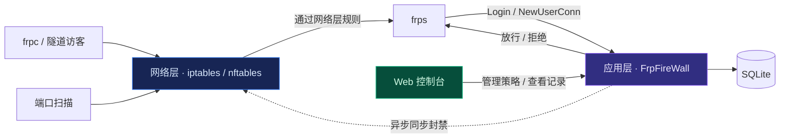

## 文档

| 文档 | 内容 |
| --- | --- |
| 本篇 | 核心能力、快速开始、安装卸载、配置项、已知边界 |
| [`docs/FEATURES.md`](docs/FEATURES.md) | 功能详解：细分规则、地区拦截、封禁范围、出口 IP、拦截统计、GeoIP |
| [`docs/TROUBLESHOOTING.md`](docs/TROUBLESHOOTING.md) | 排障：面板打不开、忘记密码、判定顺序、误封救援 |
| [`docs/DEVELOPMENT.md`](docs/DEVELOPMENT.md) | 开发：构建、测试、代码结构 |
| [`docs/RELEASE.md`](docs/RELEASE.md) | 版本格式、CI 分级、发版流程与发布闸门 |
| [`docs/SECURITY_REVIEW.md`](docs/SECURITY_REVIEW.md) | 安全与功能问题核实、修复方式和验证范围 |
| [`docs/DESIGN.md`](docs/DESIGN.md) | 架构、设计决策（D1…D30）与[关键设计约束完整版](docs/DESIGN.md#design-constraints) |

按角色和任务查找文档，见 **[文档中心 →](docs/README.md)**。

---

<div align="center">
  <strong>一份二进制，两层防护，一个控制台。</strong><br>
  <a href="docs/README.md">继续阅读文档</a> ·
  <a href="https://github.com/dreamstation625/FrpFireWall/issues">反馈问题</a>
  <p>本项目由 <strong>WorkBuddy</strong> 和 <strong>ChatGPT</strong> 支持实现。</p>
</div>
